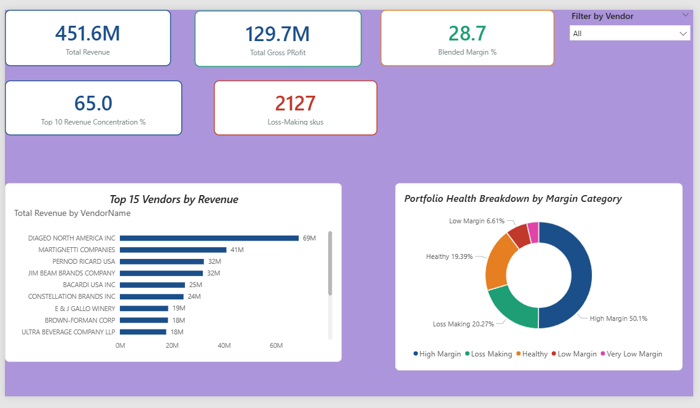
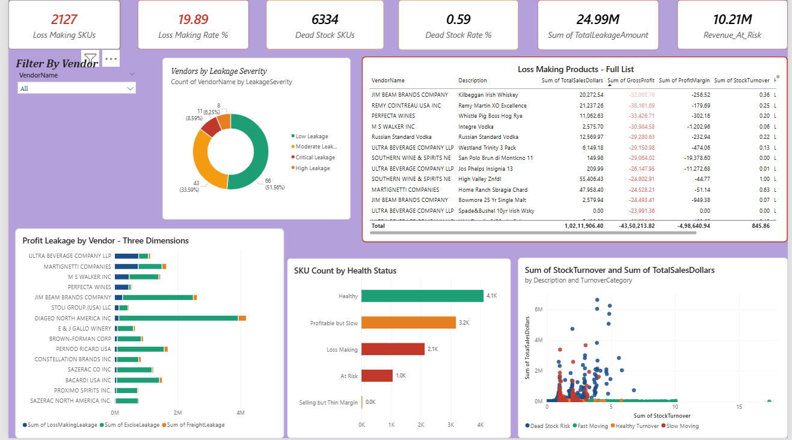
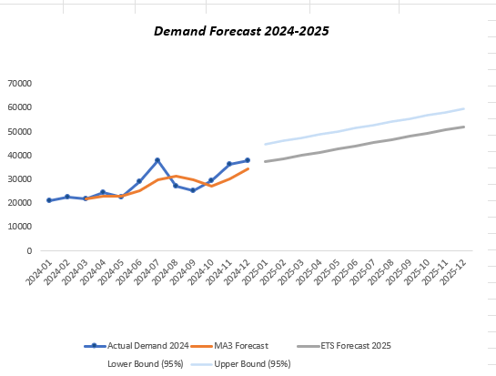

# Beverage Distribution — Vendor & Stock Performance Analytics

End-to-end commercial analytics project analyzing a beverage distributor's vendor performance, inventory health, and revenue concentration — combining SQL, Excel, Power BI, statistical forecasting, machine learning, and a GenAI insight layer.

## Key Results

- **$450.9M** total revenue analyzed across **128 vendors** and **10,495 SKUs**
- **$24.99M in profit leakage identified** (5.5% of revenue)
- **60.4% dead stock rate** (6,334 SKUs) — including 3,181 SKUs classified as profitable-but-slow, the highest-value intervention segment
- **20.3% loss-making SKUs** (2,127 SKUs)
- Top 10 vendors represent **65% of total revenue**; Diageo alone accounts for **15.2%** — a notable concentration risk
- Demand forecasting (Holt-Winters ETS) achieved **9.84% MAPE** — rated Excellent
- Random Forest classification: **95% accuracy, 0.86 F1** (after resolving data leakage from profit-margin features)

## Architecture

Bronze → Silver → Gold data pipeline built on SQL Server Express:

- **Bronze:** `vendor_sales_summary` (raw ingested data, 10,692 rows pre-cleaning)
- **Silver:** `vw_PortfolioHealth` — cleaned view with outliers excluded (10,495 SKUs)
- **Gold:** purpose-built views for each analysis — `gold_vendor_revenue`, `gold_vendor_tiering`, `gold_vendor_rankings`, `gold_profit_leakage`, `gold_pareto_analysis`, plus logistics and full-cost summary views

Key data decisions: micro-vendors under $10K revenue excluded from averages (a single vendor was distorting margin calculations by -1,487%); freight costs handled as vendor-level (MAX, not SUM) since they repeat across SKUs; three risk classifications (loss-making, dead stock, profitable-but-slow) calculated independently rather than additively.

## Note on Data

The raw dataset used in this project was purchased and is not included in this repository due to licensing restrictions on redistribution. All analysis, SQL scripts, notebooks, and results in this repo are original work built on that dataset. The schema includes vendor-level sales, purchase, and freight data across ~10,500 SKUs and 128 vendors — sufficient detail is provided in `SQL_Analysis/` to reproduce the pipeline against a similarly structured dataset.

## Tools Used

- **SQL Server** — data warehousing, view architecture, cost/margin logic
- **Python** (pandas, statsmodels, scikit-learn) — forecasting, clustering, classification
- **Excel** — 8-tab interactive workbook (Executive Summary, Vendor Analysis, Risk Dashboard, Pricing, Forecast, Seasonal Index, MAPE Tracker, Ad Hoc Analysis)
- **Power BI** — 3-page dashboard (Executive Summary, Commercial Deep Dive, Risk Dashboard) with a custom DAX measures table
- **Anthropic Claude API** — generates plain-English commercial insight summaries directly from live vendor data

## Dashboards

**Power BI — Executive Summary**

**Power BI — Risk Dashboard**

**Demand Forecast**

## How to Run

1. Clone this repo
2. Install dependencies: `pip install -r requirements.txt`
3. Copy `.env.example` to `.env` and add your own Anthropic API key
4. Set up SQL Server Express with a similarly structured dataset and run the scripts in `SQL_Analysis/`
5. Run `vendor_insights.py` to generate a live AI commercial summary from the vendor data

## Folder Guide

| Folder | Contents |
|---|---|
| `Data/` | Not included — raw dataset was purchased and isn't licensed for redistribution. See note above. |
| `SQL_Analysis/` | Bronze-Silver-Gold SQL scripts and views |
| `Notebooks/` | Forecasting, clustering, and classification notebooks |
| `Excel_Analysis/` | Interactive Excel workbook |
| `Power_BI/` | Power BI dashboard file |
| `Screenshots/` | Dashboard and output screenshots |
| `vendor_insights.py` | GenAI commercial insight generator (Claude API) |