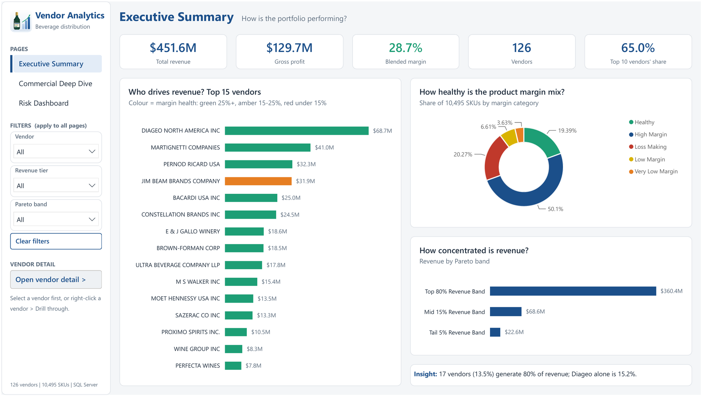
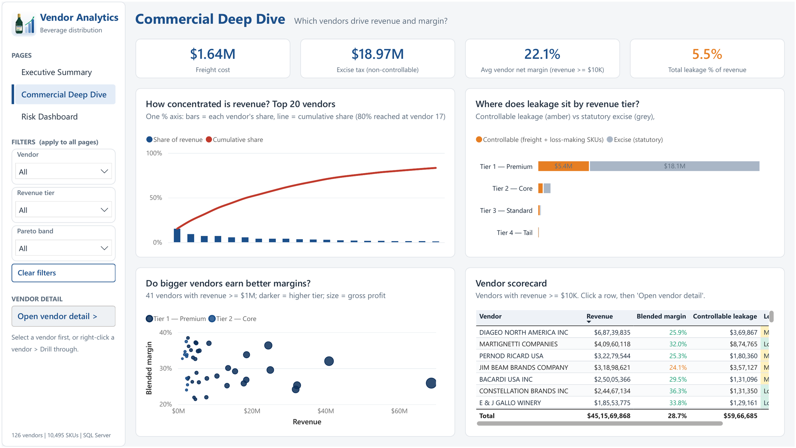
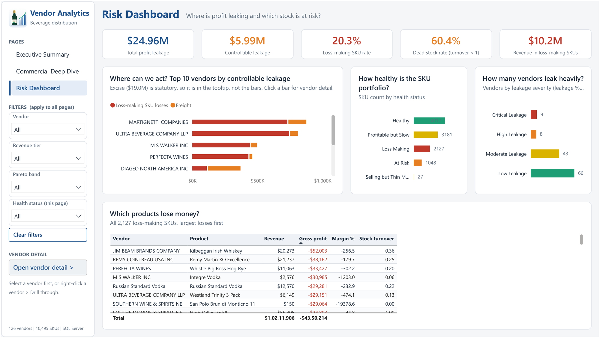
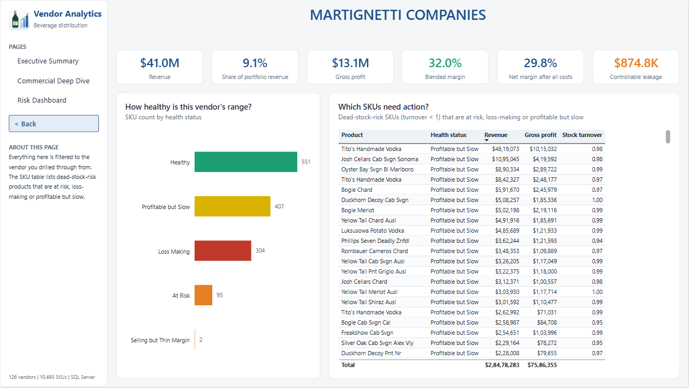
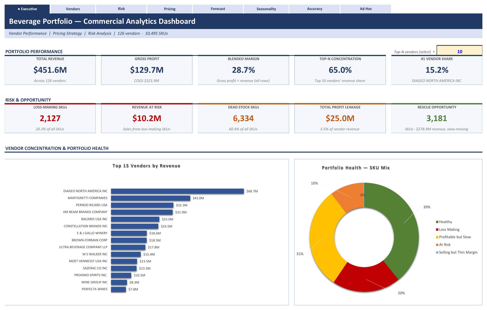
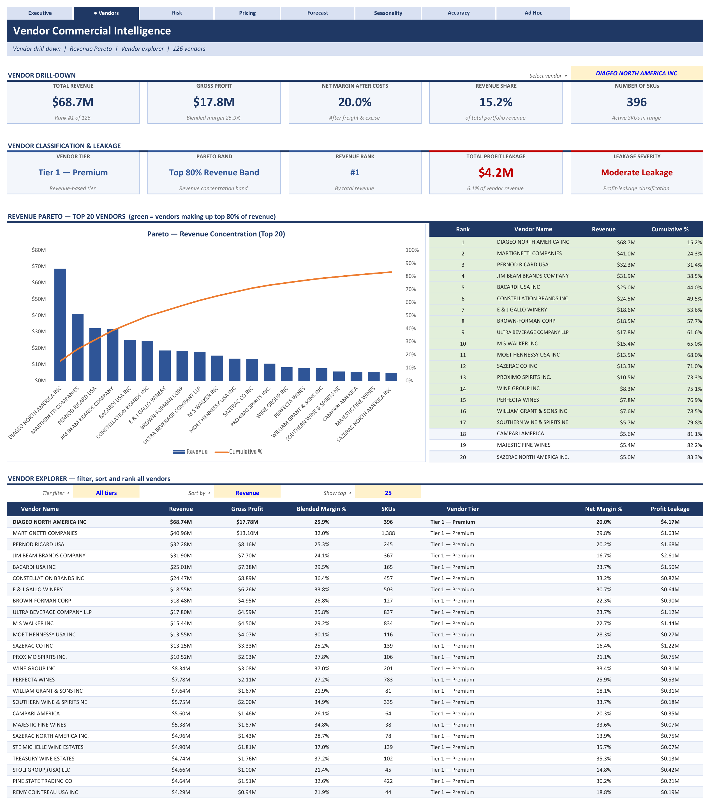
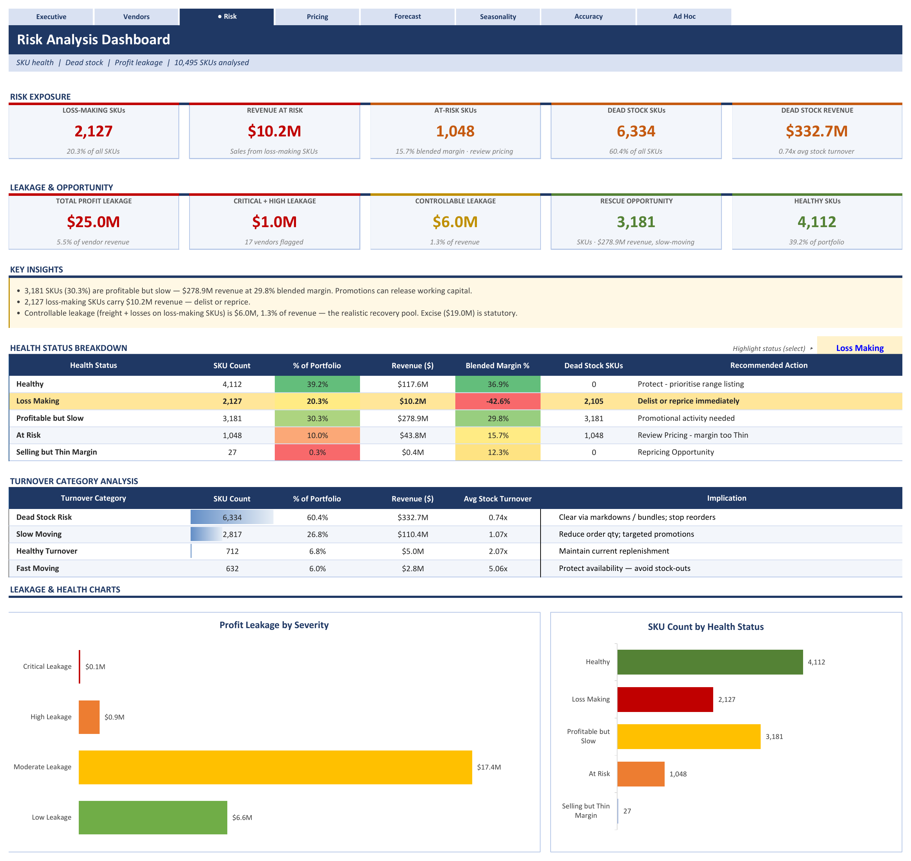
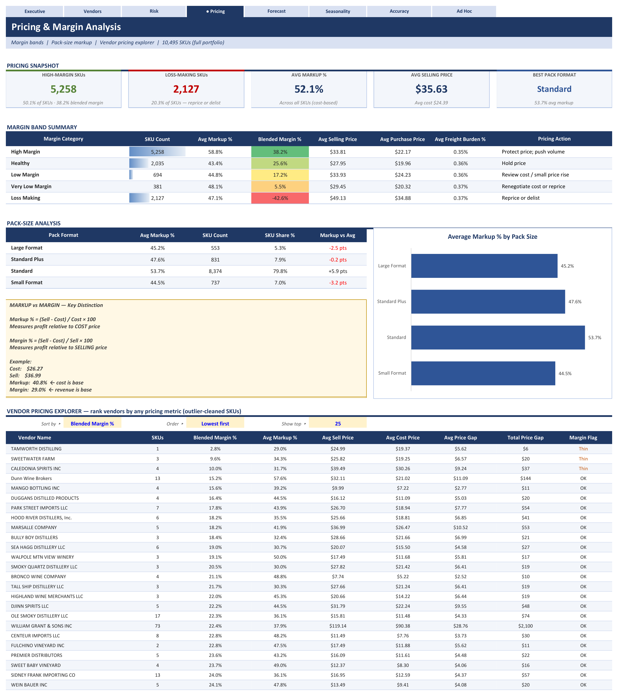
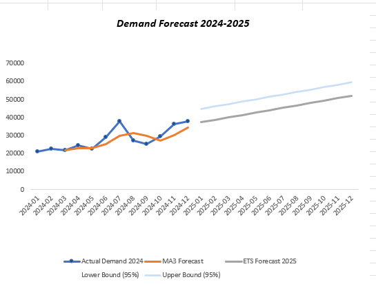

# Beverage Distribution — Vendor & Stock Performance Analytics

End-to-end commercial analytics project analysing a beverage distributor's vendor performance, inventory health, profit leakage and revenue concentration — combining SQL Server, Excel, Power BI, statistical forecasting, machine learning and a GenAI insight layer.

## Key Results

- **$450.9M revenue** analysed across **10,495 SKUs** and **125 vendors** after outlier exclusion (all rows: $451.6M, 10,692 SKU rows, 126 vendors)
- **28.6% blended gross margin** ($129.1M gross profit)
- **Net profit after all costs (COGS, freight, excise): $109.1M, a 24.2% blended net margin.** Across the 105 vendors with revenue ≥ $10K, the average vendor net margin is 22.1%, ranging from -24.9% to 69.0%
- **$24.96M total cost leakage (5.5% of revenue), split by what management can act on:** **$5.99M controllable** (loss-making SKUs $4.35M + freight $1.64M, 1.3% of revenue) and **$18.97M non-controllable** excise tax (4.2%). The controllable $5.99M is the realistic recovery target; Martignetti ($0.87M) and Ultra Beverage ($0.81M) alone account for 28% of it
- **60.4% of SKUs at dead stock risk** (6,334 SKUs with stock turnover below 1.0), including **3,181 profitable-but-slow SKUs (30.3%)**, the highest-value intervention segment
- **20.3% of SKUs are loss-making** (2,127 SKUs), running a blended margin of -42.6%
- **Pareto concentration:** 17 of 126 vendors (13.5%) generate 80% of revenue ($360.4M); the 91-vendor tail contributes 5%
- **Top 10 vendors = 65.0% of revenue**; Diageo alone accounts for 15.2%, a notable concentration risk
- Demand forecasting (Holt-Winters ETS, built in Excel) achieved **9.84% MAPE**, rated Excellent
- Random Forest classification: **95% accuracy, 0.86 F1** (after resolving data leakage from profit-margin features)

## SQL Architecture

Built on SQL Server Express (`Vendor_sales` database) in four layers:

1. **Raw:** `dbo.vendor_sales_summary` holds 10,692 SKU-level rows
2. **Vendor standardisation:** `vw_VendorSalesBase` gives each vendor number one canonical name. Every analytical view reads from this base
3. **Cleaned base:** `vw_PortfolioHealth` excludes extreme turnover outliers (StockTurnover > 10), leaving 10,495 SKUs. It adds markup %, freight and excise burden %, net margin after excise, and four classifications (HealthStatus, MarginCategory, TurnoverCategory, VolumeCategory). `vw_CleanAnalysis` provides a stricter subset of profitable SKUs with valid pricing
4. **Analytical views**, each answering one business question:

| View | Purpose | Feeds |
|---|---|---|
| `vw_VendorRevenueSummary` | Revenue, gross profit, blended margin and revenue share by vendor | GenAI insight tool |
| `vw_VendorTiering` | Revenue tiers via NTILE quartiles (Premium / Core / Standard / Tail) | Power BI: revenue-tier filter, Commercial Deep Dive |
| `vw_ParetoAnalysis` | Cumulative revenue %, 80/15/5 Pareto bands, critical-vendor flag | Power BI: Executive Summary, Commercial Deep Dive, Pareto-band filter; Excel Executive Summary |
| `vw_ProfitLeakage` | Excise, freight and loss-making leakage per vendor, split into controllable vs non-controllable, with severity rating | Power BI: Risk Dashboard, Commercial Deep Dive, Vendor Detail; Excel Risk tab; GenAI insight tool |
| `vw_LossMakingAnalysis` | SKUs that are loss-making, below 20% margin, or at dead stock risk | Ad hoc analysis |
| `vw_LogisticsCostSummary` | COGS ratio, freight and excise as % of revenue, net margin after all costs | Power BI: Commercial Deep Dive KPIs |
| `vw_FullCostAnalysis` | Net profit after all costs, benchmarked against the average of vendors with revenue ≥ $10K | Ad hoc analysis |
| `vw_VendorRankings` | DENSE_RANK on revenue, blended margin and turnover with a composite score, flagging revenue-vs-margin misalignment | Ad hoc analysis |
| `vw_PricingAnalysis` | Markup vs gross margin, within-vendor markup ranking (DENSE_RANK, LAG) to surface pricing inconsistency | Ad hoc analysis |

**Portfolio health breakdown** (from `vw_PortfolioHealth`): Healthy 4,112 SKUs · Profitable but Slow 3,181 · Loss Making 2,127 · At Risk 1,048 · Selling but Thin Margin 27

The script ends with a set of data checks (for example, confirming that gross profit equals sales minus purchases, and that freight is one value per vendor), each with its expected result.

### Key data decisions

- **Vendor names standardised by vendor number.** Two vendors appear under two names each (Southern Wine & Spirits NE / Southern Glazers W&S of NE, and Vineyard Brands Inc / LLC). Freight is recorded per vendor number, so analysing by name would count their freight twice and create false freight burdens of 47% and 140%.
- **Freight is taken once per vendor (MAX, not SUM).** Freight repeats on every SKU row for a vendor; summing it would inflate Martignetti's freight from $145K to $201M.
- **Margins are blended from totals** (total gross profit ÷ total revenue) rather than simple averages of SKU margins, which extreme SKUs distort. Martignetti's simple-average margin is -37.1%, but its blended margin is **+32.0%** on $13.1M gross profit. Margin rankings use blended margin.
- **Micro-vendors excluded from margin averages, benchmarks and rankings:** 21 vendors under $10K revenue, leaving 105.
- **Two data bases, stated explicitly.** Portfolio health metrics use the outlier-cleaned base (StockTurnover ≤ 10). Vendor-level views use all rows, because turnover outliers are a stock-data issue, not a revenue issue.
- **Leakage is split into controllable and non-controllable.** Total leakage = excise + freight + losses on loss-making SKUs. Excise is a statutory tax, so it is reported as non-controllable. Dead stock is tracked separately as revenue at risk rather than added to leakage.
- **Risk classifications are independent:** loss-making, dead stock and profitable-but-slow overlap, so they are not summed.

## Note on Data

The raw dataset was purchased via Topmate and is not redistributed here, out of respect for the original creator. All analysis, SQL, notebooks, dashboards and results in this repo are my own work built on that dataset. The schema covers SKU-level sales, purchase, excise and freight data for ~10,700 SKU rows across 126 vendors; the view definitions in `SQL Analysis/` document the full pipeline for reproduction against a similarly structured dataset.

## Tools Used

- **SQL Server:** layered view architecture, CTEs, window functions (NTILE, DENSE_RANK, LAG, running SUM OVER), NULLIF/COALESCE data-quality guards, built-in validation checks
- **Python** (pandas, scikit-learn, statsmodels): exploratory analysis, vendor segmentation (clustering) and Random Forest classification
- **Excel:** interactive workbook including the Holt-Winters (ETS) demand forecast with seasonal index and MAPE tracker, plus Executive Summary, Vendor Analysis, Risk Dashboard, Pricing and Ad Hoc Analysis sheets. Dashboards report blended margins (gross profit ÷ revenue) and separate controllable leakage from non-controllable excise
- **Power BI:** 4-page interactive report (Executive Summary, Commercial Deep Dive, Risk Dashboard, Vendor Detail drillthrough) on a star-schema model with DAX measures, version-controlled as a Power BI Project (PBIP)
- **Anthropic Claude API:** generates evidence-based commercial insight summaries from live vendor data

## Power BI Report

**Data model: star schema.** `Vendor_Revenue` (one row per vendor, 126 vendors) is the vendor dimension. Every other table, from SKU-level facts (`vw_PortfolioHealth`, 10,495 SKUs) to vendor-level views (`vw_ProfitLeakage`, `vw_LogisticsCostSummary`, Pareto and tiering), relates to it **many-to-one with single-direction filtering**. Vendor attributes used for slicing (revenue tier, Pareto band, leakage severity) live on the dimension, so one filter flows to every fact without bi-directional relationships.

**Pages**

| Page | Question it answers | Highlights |
|---|---|---|
| Executive Summary | How is the portfolio performing? | Revenue, gross profit, blended margin, vendors, top-10 share; top 15 vendors coloured by margin health; margin mix; Pareto bands |
| Commercial Deep Dive | Which vendors drive revenue and margin? | Freight, excise, average net margin, leakage %; Pareto curve; controllable vs excise leakage by tier; revenue vs margin scatter; vendor scorecard |
| Risk Dashboard | Where is profit leaking and which stock is at risk? | Total and controllable leakage, loss-making and dead-stock rates; top 10 vendors by controllable leakage; SKU health; severity; loss-making products |
| Vendor Detail (drillthrough) | What does one vendor look like? | Rank, tier, band and severity; revenue share, margins, controllable leakage; health mix; SKUs needing action |

**Interactivity:** left navigation rail, slicers synced across pages (vendor, revenue tier, Pareto band), a Clear filters button, drillthrough to Vendor Detail by right-click or the *Open vendor detail* button, cross-filtering, tooltips, and rule-based colour (margin and severity thresholds defined as DAX measures).

**Stored as a Power BI Project (PBIP).** The model is saved as TMDL and the report as PBIR text files, so every measure, relationship and visual change is reviewable in Git. The imported data cache is excluded by `.gitignore`, so the purchased dataset never enters the repository. Open `Power BI/Vendor Analytics.pbip` in Power BI Desktop and refresh against SQL Server to load data.

## Dashboards

**Power BI — Executive Summary**

**Power BI — Commercial Deep Dive**

**Power BI — Risk Dashboard**

**Power BI — Vendor Detail (drillthrough, Martignetti)**

**Excel — Executive Summary**

**Excel — Vendor Analysis**

**Excel — Risk Dashboard**

**Excel — Pricing and Margin Analysis**

**Excel — Demand Forecast (Holt-Winters ETS)**

## GenAI Insight Tool

`vendor_insights.py` turns the SQL results into a written commercial summary using the Claude API:

1. **Python pulls the facts** from three queries: portfolio totals with the leakage split (`vw_ProfitLeakage`), the top 10 vendors by revenue (`vw_VendorRevenueSummary`), and the top 10 vendors by controllable leakage.
2. **Python does the arithmetic.** Every percentage, rank and count (for example, which vendors sit below the portfolio margin) is calculated in code and passed to the model ready-made, so the model never has to count or calculate.
3. **The model writes the narrative under strict evidence rules:** use only the figures provided, cite the figures behind every recommendation, keep each figure with its own vendor, recommend only actions the data supports, and state what the data cannot show. It runs at temperature 0 for repeatable output.
4. **Output is verified against the source data before publishing.** `vendor_insight_output.txt` is a verified sample.

The API key is read from a local `.env` file and never stored in code.

## How to Run

1. Clone this repo
2. Install dependencies: `pip install -r requirements.txt`
3. Copy `.env.example` to `.env` and add your own Anthropic API key
4. Load a similarly structured dataset into SQL Server Express and run `SQL Analysis/Vendor_analysis.sql` to create the views
5. Run `python vendor_insights.py` to generate an AI commercial summary
6. Open `Power BI/Vendor Analytics.pbip` in Power BI Desktop and select **Refresh** to load the report from your SQL Server

## Folder Guide

| Folder / File | Contents |
|---|---|
| `Data/` | Not included; the raw dataset was purchased via Topmate and is not redistributed (see Note on Data) |
| `SQL Analysis/` | Full SQL script: data profiling, view definitions and validation checks |
| `Notebooks/` | EDA, vendor performance analysis, and segmentation/prediction notebooks |
| `Excel Analysis/` | Interactive Excel workbook, including the Holt-Winters demand forecast |
| `Power BI/` | Power BI Project: open `Vendor Analytics.pbip`; model in `.SemanticModel` (TMDL), report in `.Report` (PBIR); no data included |
| `Screenshots/` | Dashboard and output screenshots |
| `vendor_insights.py` | GenAI commercial insight generator (Claude API) |
| `vendor_insight_output.txt` | Verified sample output from the GenAI tool |
| `requirements.txt` | Python dependencies (`pip install -r requirements.txt`) |
| `.env.example` | Template for the Anthropic API key; copy to `.env` and add your own key |